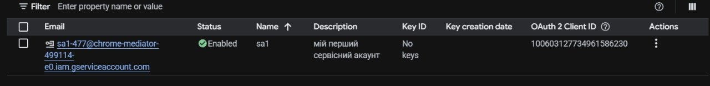
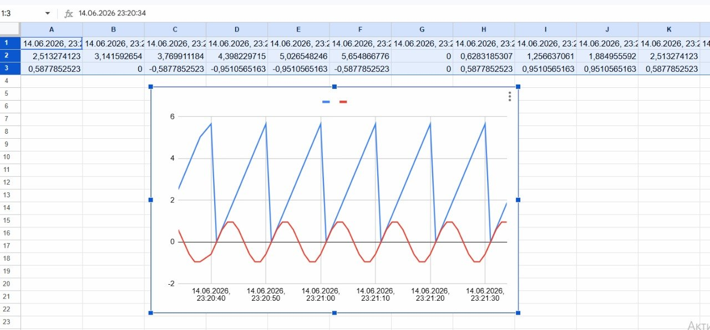
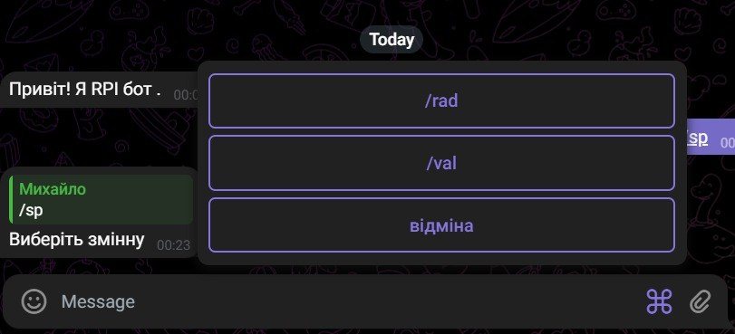
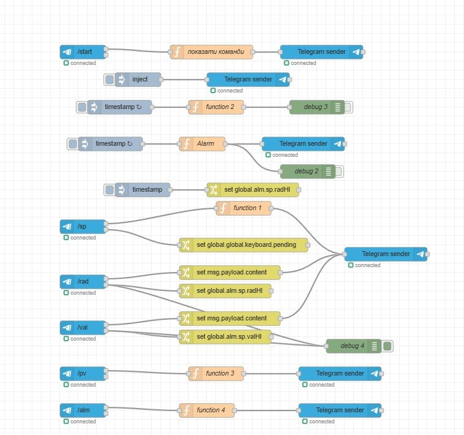

## Звіт до лабараторної роботи №12
### 1. Інтегрування Node-RED з застосунком Google Sheet

 тут я створив та відкрив перелік сервісних акаунтів
 
 

Тут я створив фрагмент запису в електронну таблицю значень буферу

## 2. Створення Телеграм-бота в Node-RED

Тут за допомогою вузлів із Node-red я додав команди від яких потім іде текстове повідомлення

Ось так виглядає мій код за допомогою якого функціонує Бот в Телеграмі

