## Звіт з лабараторної роботи №3  ##

Після встановлення Node.JS я запустив командний рядок та вивів версію Node.JS і версію пакетного менеджера через команди node -v і npm -v.

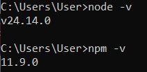

Далі я запустив Node-Red. Там я розмістив вузли і зробив розгортання.

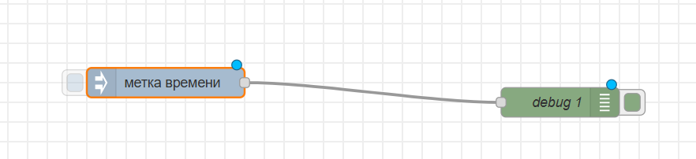

Тут я налаштував вузол Inject на періодичне оновлення.

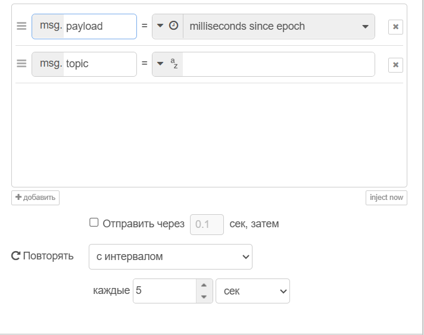

Тут я налаштував вузол Inject на текстове повідомлення.

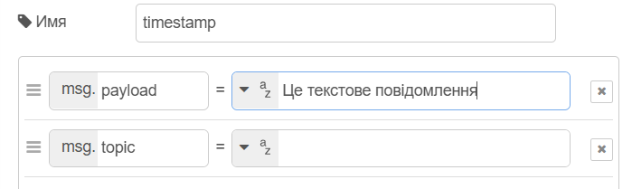

Зробивши програму з використанням вузлів "Change", "Delay" та "Function", debug 1 виводив слова із затримкою в одну секунду. А debug 2 виводив Дату та час з проміжком у п'ять секунд.

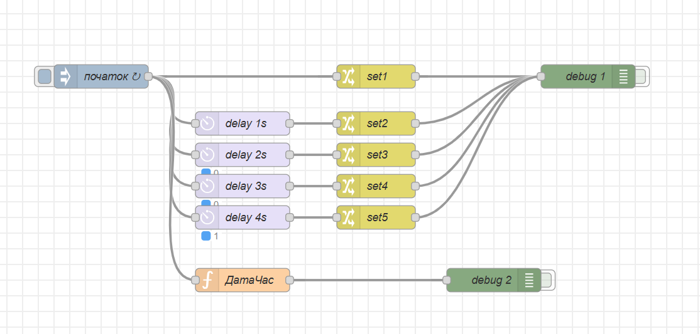
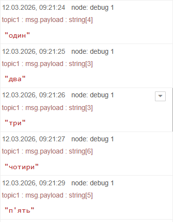
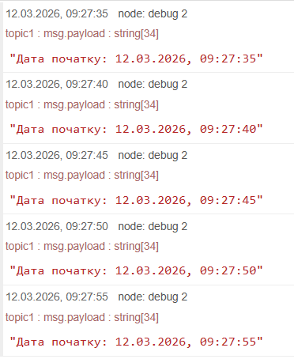

Далі я встановиви новий вузол "node-red-contrib-os", і зробив невеличку команду з використанням NetworkIntf

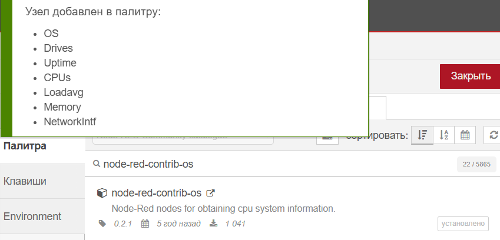
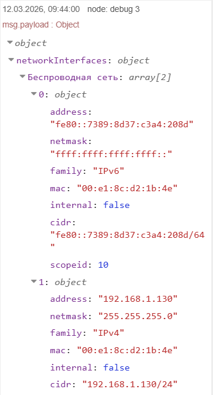

Тут я створив фрагмент коду для того щоб виводився тільки перелік MAC адрес для мережних карт.

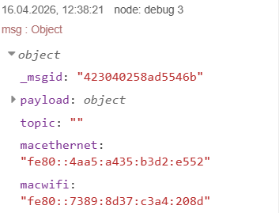

Експорт фрагменту потоку у форматі JSON.

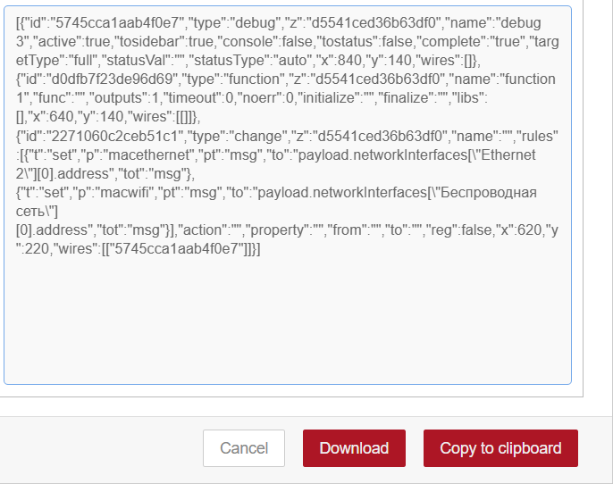
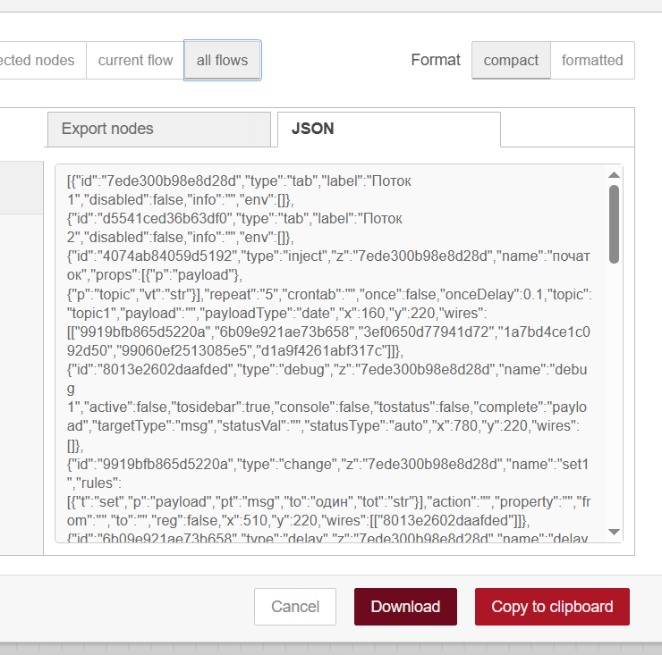

Тут я створив папку "flowstartlab" для того щоб перенести туди файли "flows.json" та "flows_cred.json", після чого в мене Відкрився повністю порожній потік. А потім додавши вузол Inject (можна додати будь-який інший), у папці ".node-red" з'явився файл "flows.json".

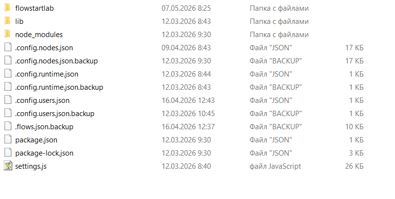

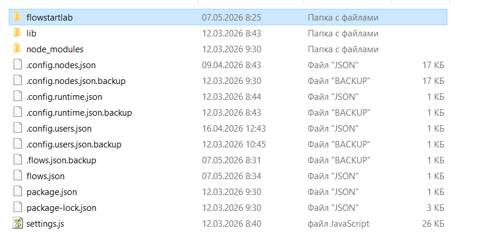

Далі я переніс файли з папки "flowstartlab" у папку ".node-red", після чого в мене повернулися мої потоки.

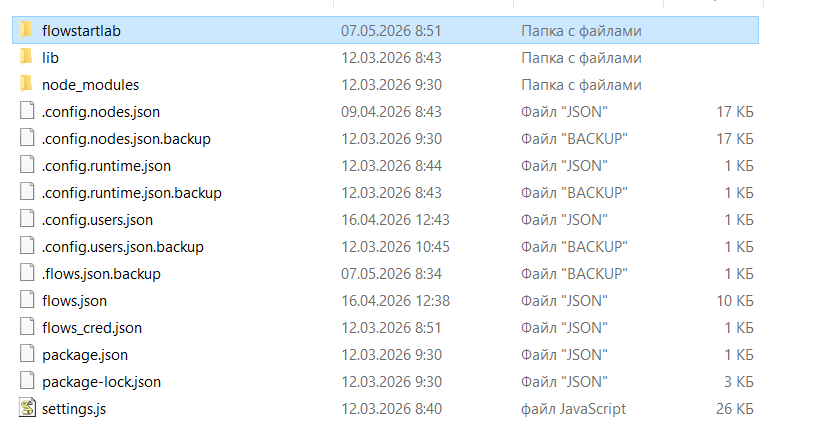
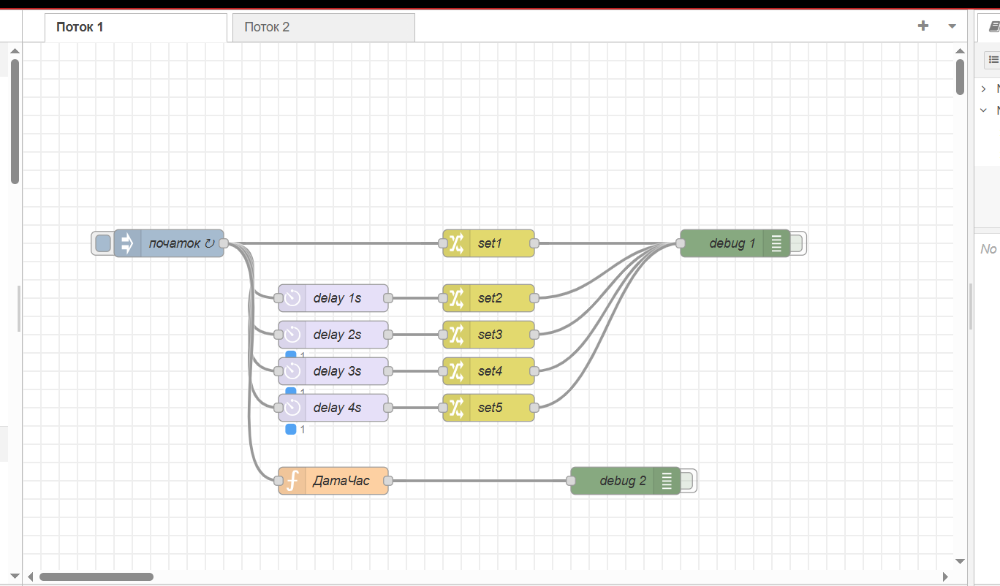
 - [Потоки](lab3.json)