## Звіт для лабараторної 4 ##

Після встановлення палітри flowfuse/node-red-dashboard, я розмістив вузли inject і gauge. А на скіншоті нижче я налаштовував вузл inject

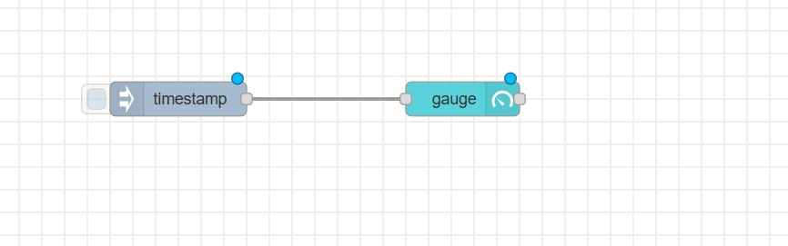
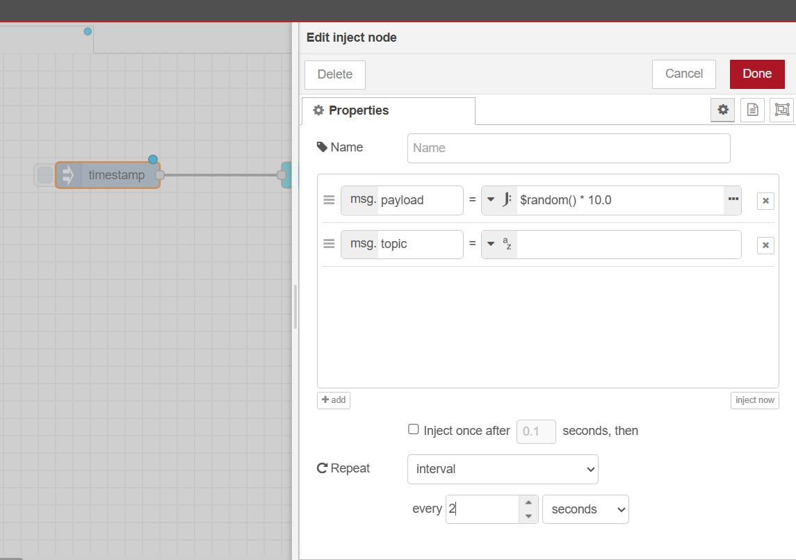

Далі я перейшов в дашборт, щоб побачити що відображає індикатор 

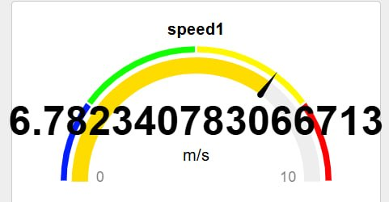

Далі я додав нову кольрову гаму, та змінив значення, щоб після крапки була тількт одна цифра 

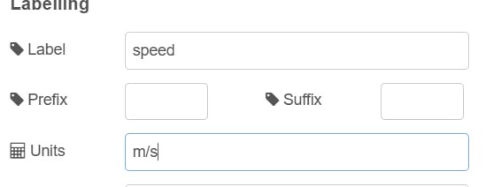

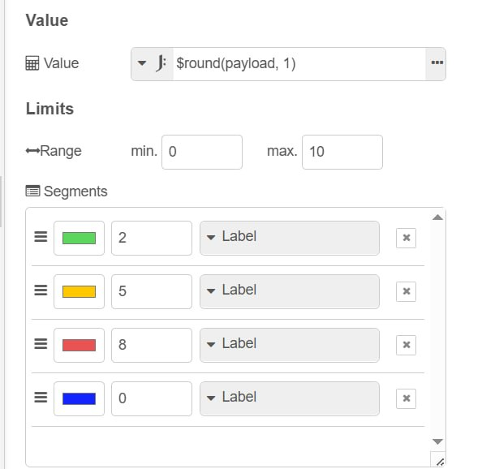

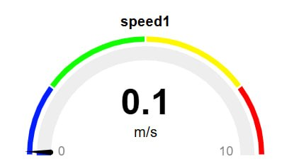

Далі я скопіював віджет спід два рази і преєднав їх до inject 

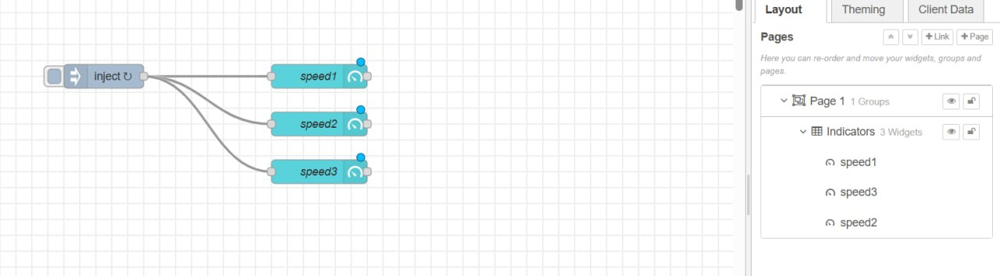

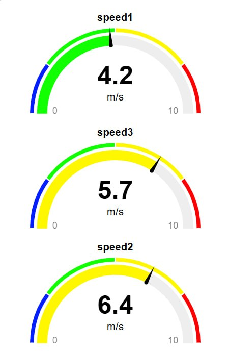

Тут я зробив так щоб вони розташовувалися горизонтально.

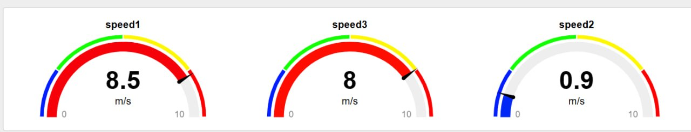

Далі я налаштовував спід 2 та спід 3, щоб вони виглядали по різному, як на скріншоті знизу

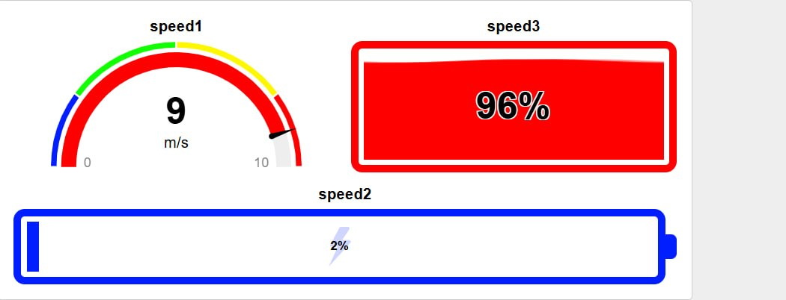

Тут я імпортував ще один віджет 

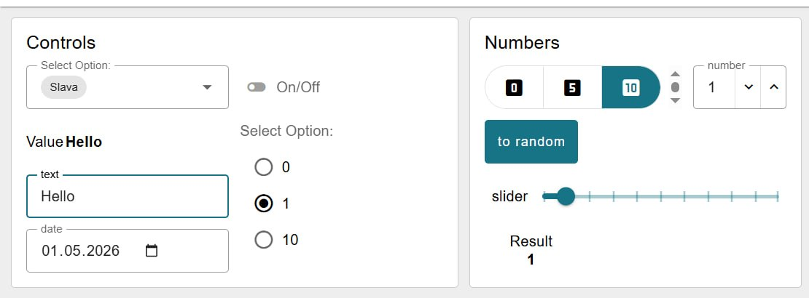

Далі я його налаштував , щоб у вікні з числом відображався колір та додав у select otion нову кнопку при натискані на яку value видає значення 2

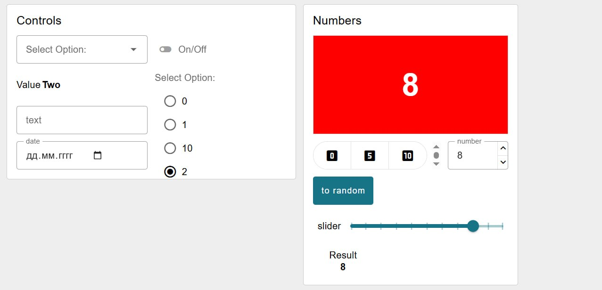

Далі я імпортував таблицю в ній додав нову колонку Num де відображалося значення поля прогрес у вигляді числа 

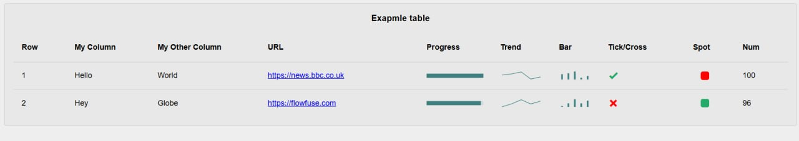

-[потоки](lab4.json)