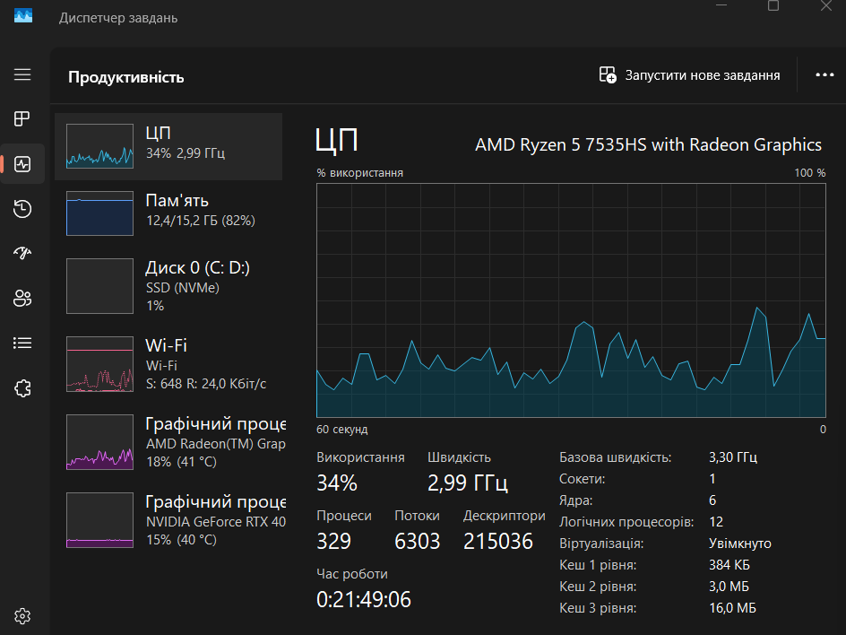
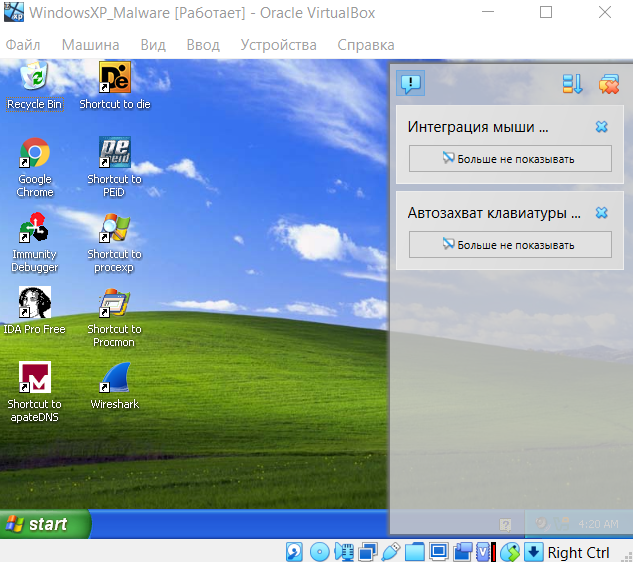
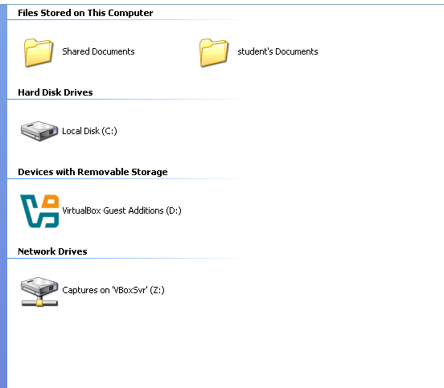
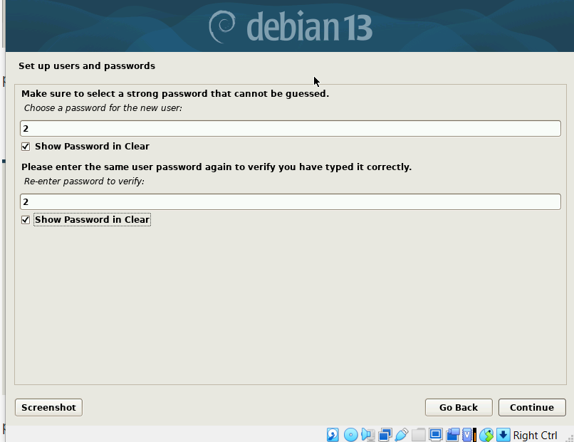
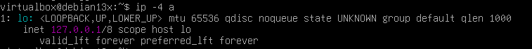
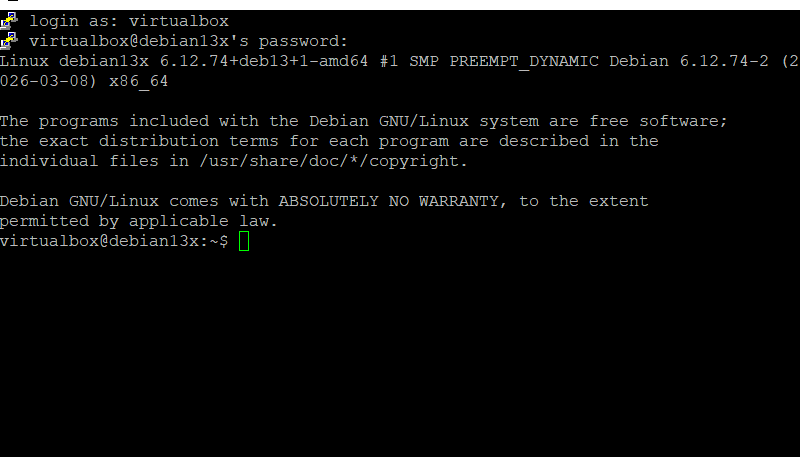
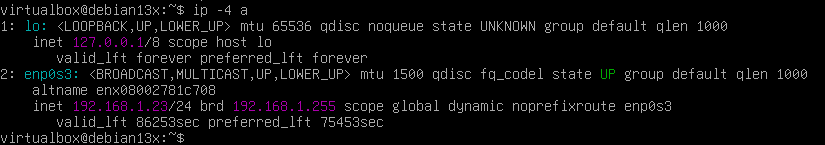
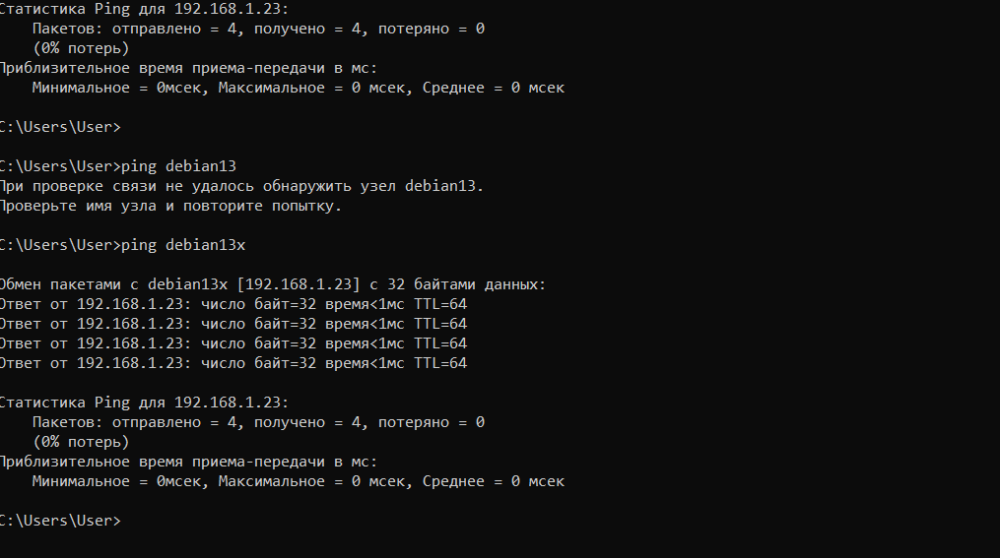

## Звіт для лабараторної роботи №6 

Тут я подивився чи активована у мене віртуалізація у вкладці "продуктивність".

Тут я встановив "WindowsXP"

Тут я створив спільну папку і додав її до WindowsXP.

Далі я встановив та налаштував Debian13, створив хостнейм, пароль, обирав мову на якій буде ця ОС, і т. д.

Тут я запустив Debian13, щоб перевірити чи все гаразд.

Далі я отримав доступ до Debian13 через PuTTY. Це було зроблено для того, щоб PuTTY давав можливість працювати в командному режимі з Windows.

Далі я отримав доступ через WinSCP. Це було для того, щоб можна було отримувати та записувати файли через табличне представлення.

