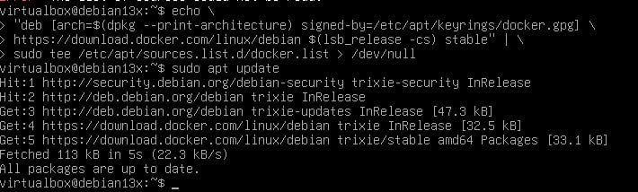
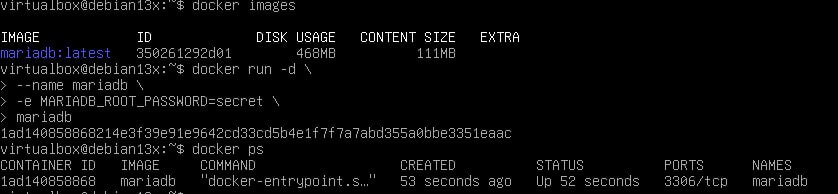
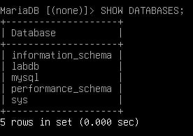
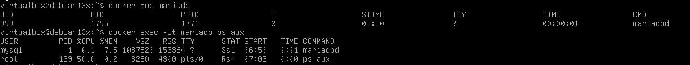
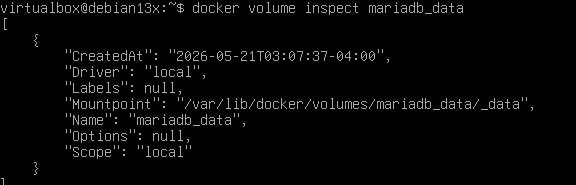
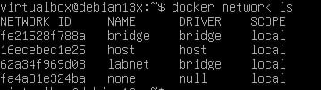
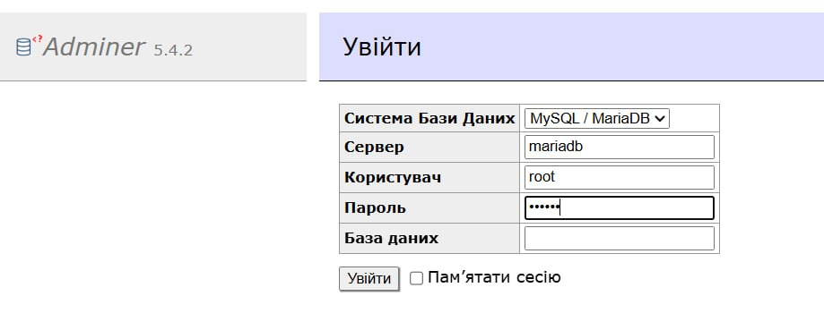
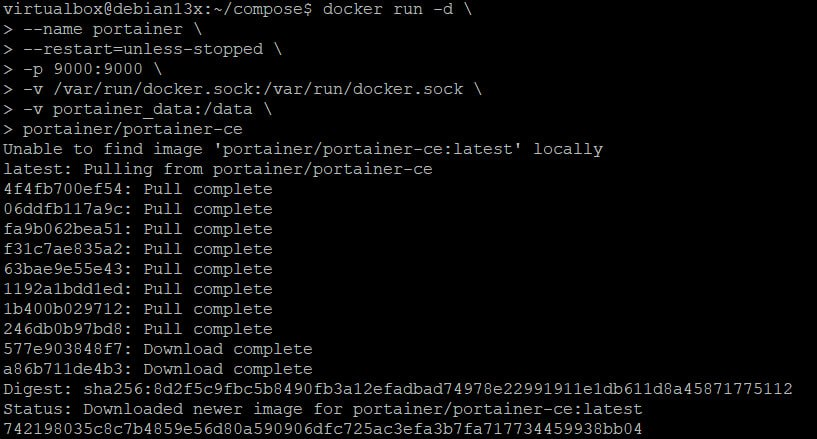
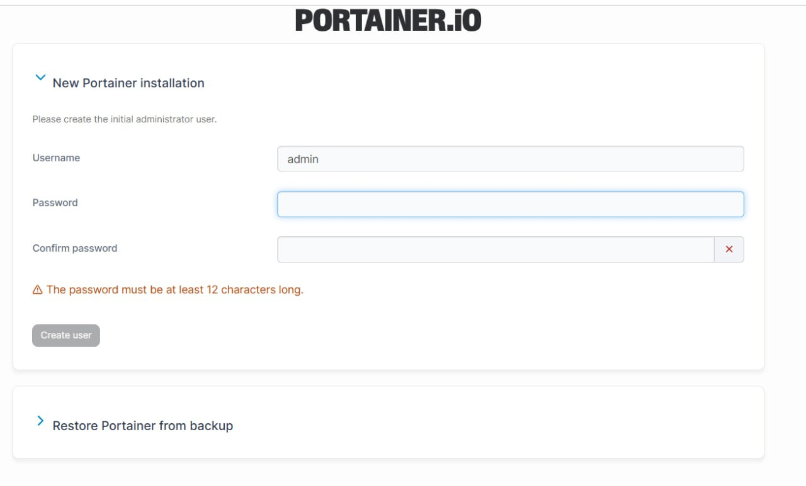

## Звіт до лабараторної роботи №7 

Я додав офіцийний репозиторій Docker до системи керування пакетами Debian

Тут я перивіряв чи завантажений в мене Docker образ MariaDB

Тут я переглянув журнали запуску MariaDB

Тут я переглянув процеси контейнера з хоста 

Тут я переглянув детальну інформацію про Volume 

Тут я переконався що мережа створена

Тут я відкрив у браузері хостової машини Debian13X

Тут я запустив контейнер portainer 

Тут я з хостової машини відкрив веб консоль

Тут я переконався що у списку присутній portainer і він знаходиться в стані ranning

