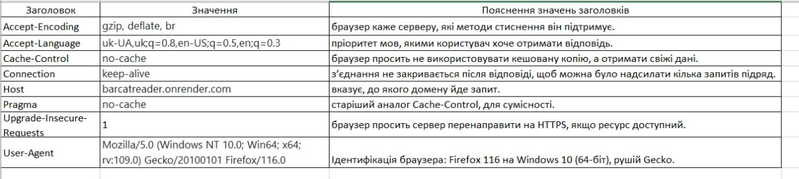
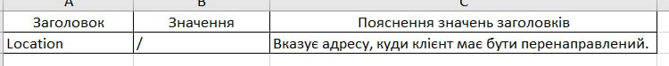
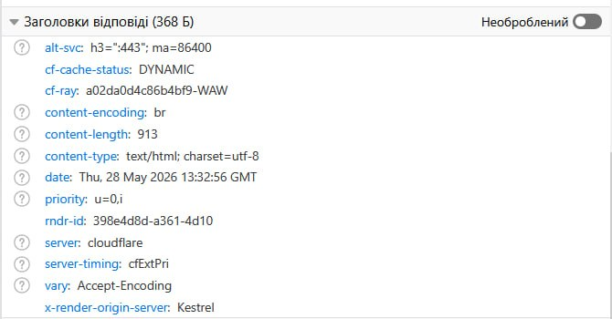
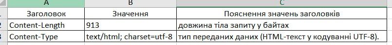
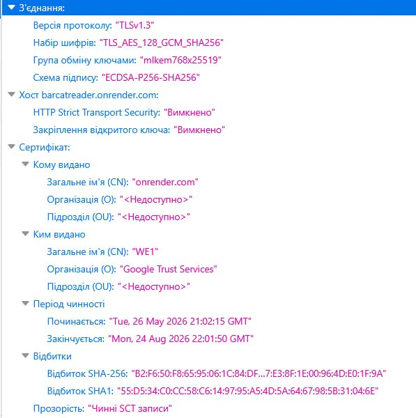
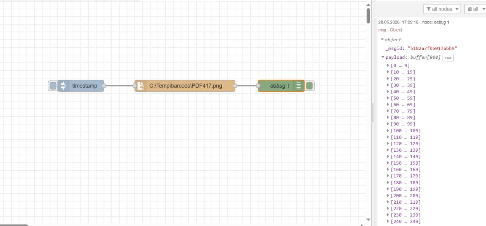
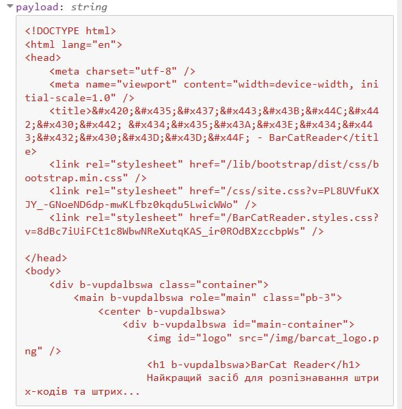
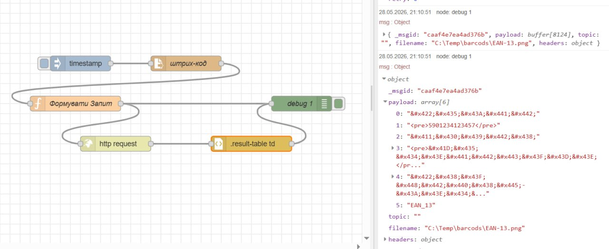
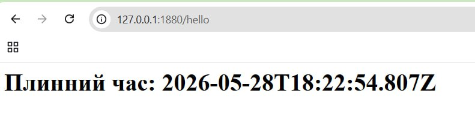

## Звіт до лабараторнї роботи №8 

Тут я заповнив таблицю 1 

Це я заповнив таблицю 2

Тут я заповнив таблицю 4

Тут я налаштував вузл File in так щоь він виводив данні з файлу з штрих кодом та виводив його вміст на панель відлагодження 

Тут я зробив формування запиту 

Тут я працював з http-in,http-respons та template

