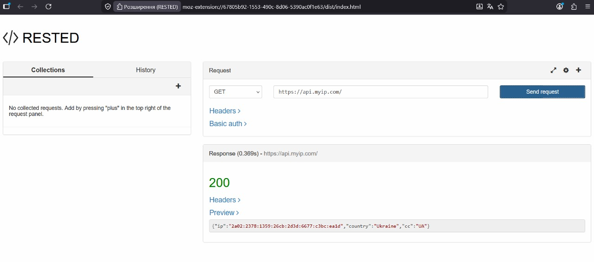
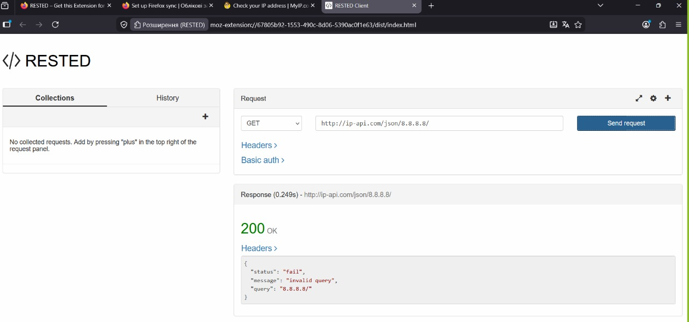
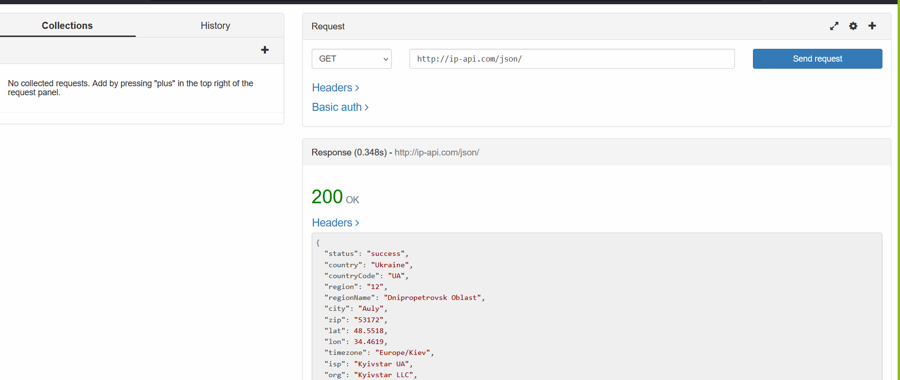
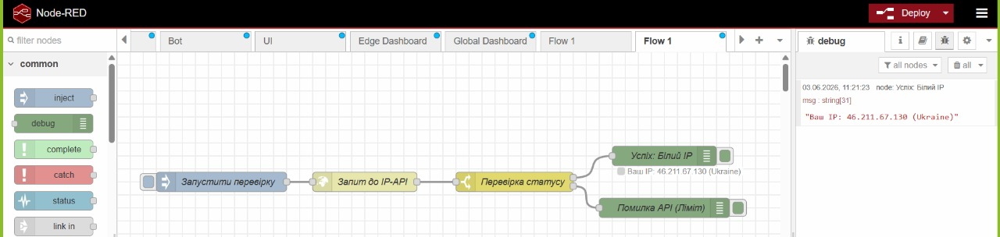
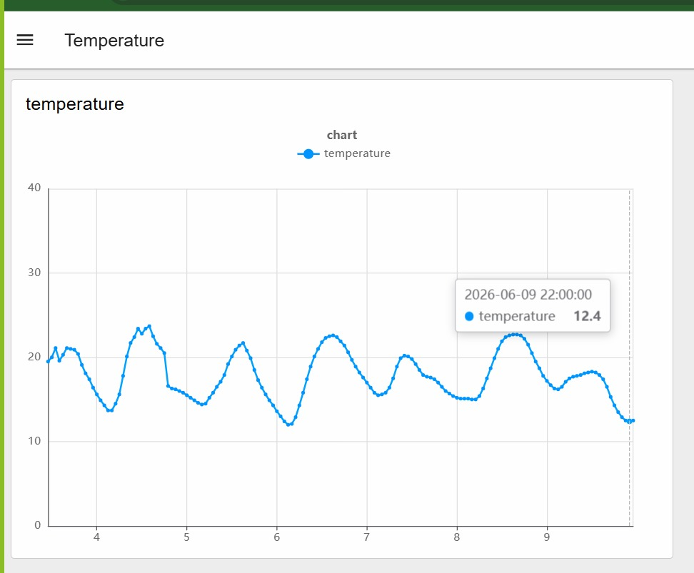

## Звіт до лабараторної роботи №9

Тут я перевірив роботу Api

Тут я вставляв адресу  http://ip-api.com/json/8.8.8.8/

Тут я вставляв адресу  http://ip-api.com/json/

Тут я через Node-red  витягнув інформацію про білий IP

Тут я створив фрагмент коду щоб пренести грвафік з данними про температуру з сайту який був вказаний в методичці

